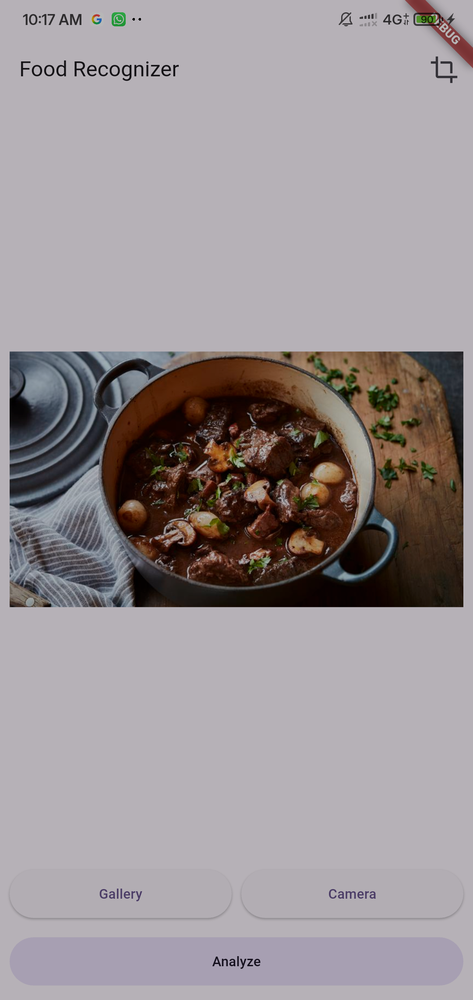
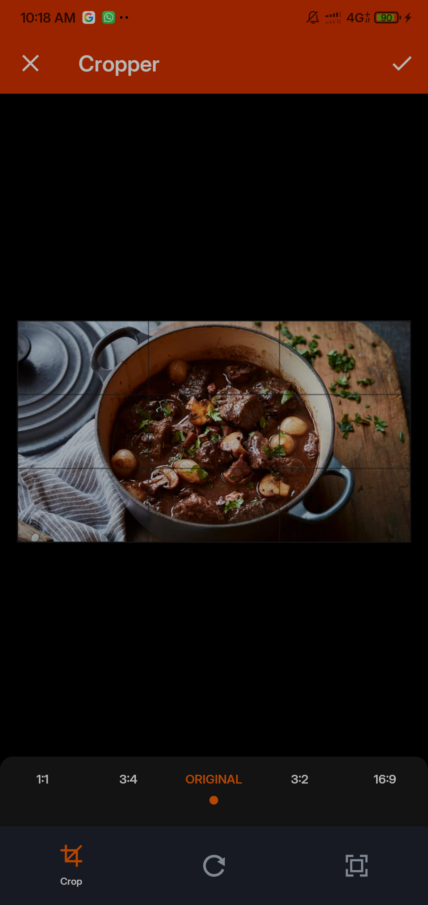
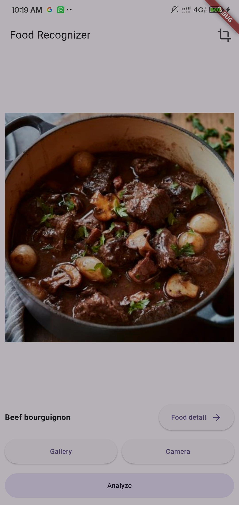
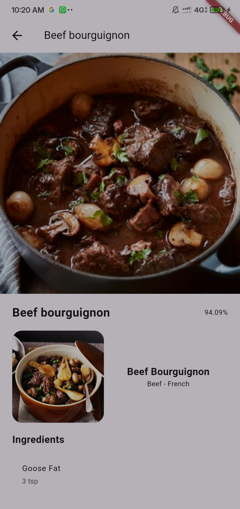
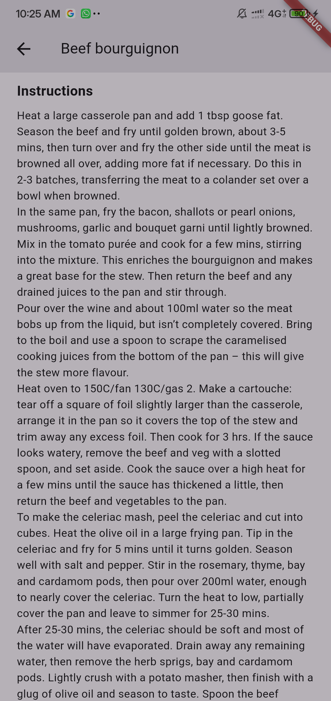

# Food Recognizer App 

[](https://flutter.dev)  
[](https://github.com/bayutp/Dicoding-Food-Recognizer/blob/main/LICENSE)  

Submission project untuk kelas [Belajar Penerapan Machine Learning untuk Flutter](https://www.dicoding.com/academies/758).  

Aplikasi ini mampu **mendeteksi foto/gambar makanan** dan menampilkan **resep lengkap** di halaman detail dimana data resep diambil dari API [TheMealDB](https://www.themealdb.com/).

## ✨ Fitur Utama

### 🏠 Home
Halaman **Home** memiliki 4 tombol utama:
- **Gallery** → memilih gambar dari galeri.
- **Camera** → membuka kamera untuk mengambil gambar.
- **Crop** → memotong gambar yang sudah dipilih.
- **Analyze** → menganalisis gambar dan memulai proses klasifikasi. 

<p style="margin-top:30px">
  
  
  
</p>  

---

### 📝 Detail Food
Halaman **Detail Food** menampilkan informasi lengkap hasil prediksi, meliputi:
- Gambar makanan
- Nama makanan
- Skor prediksi
- Daftar bahan (ingredients)
- Langkah pembuatan (step by step) 

<p style="margin-top:30px">
  
  
</p> 

---

## 🚀 Cara Menjalankan Aplikasi  

1. Clone repository ini:  
   ```bash
   git clone https://github.com/bayutp/dicoding-flutter-fundamental.git
   cd dicoding-flutter-fundamental
2. **Install dependency Flutter**
    ```bash
    flutter pub get
3. **Jalankan aplikasi di emulator atau perangkat fisik**
    ```bash
    flutter run

## 📦 Packages yang Digunakan  

- [`http`](https://pub.dev/packages/http) → Mengambil data detail makanan dari TheMealDB.  
- [`provider`](https://pub.dev/packages/provider) → State management untuk mengatur data & UI. 
- [`image_picker`](https://pub.dev/packages/image_picker) → Mengambil gambar dari galeri maupun kamera.
- [`image`](https://pub.dev/packages/image) → Kebutuhan inference model.
- [`image_cropper`](https://pub.dev/packages/image_cropper) → Memotong foto atau gambar.
- [`tflite_flutter`](https://pub.dev/packages/tflite_flutter) → Image classification menggunakan TensorFlow Lite.

---

## 📄 Lisensi & Penggunaan Source Code

Source code ini bebas digunakan untuk belajar dan referensi pribadi.
Namun, dilarang mengirimkan ulang proyek ini secara langsung (tanpa modifikasi signifikan) sebagai submission di kelas [Belajar Penerapan Machine Learning untuk Flutter](https://www.dicoding.com/academies/758) di Dicoding.

Silakan gunakan sebagai inspirasi dan kembangkan sesuai gaya & ide kreatifmu sendiri.
